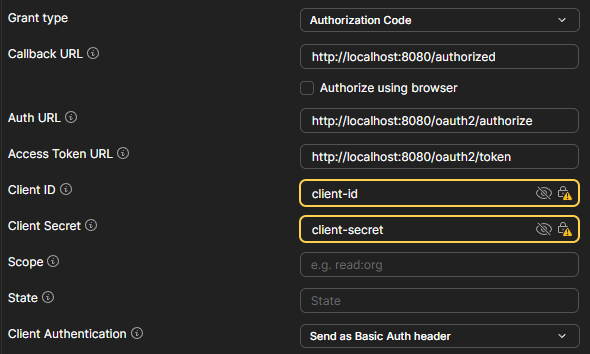
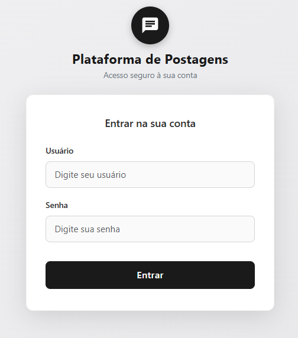
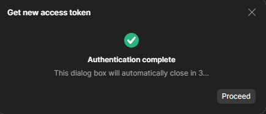

## Posts API
 


 
Este projeto se trata de uma API REST de postagens e foi construído utilizando Spring Boot, Spring Data JPA, Spring Security, JWT e PostgreSQL como banco de dados.
 
## Versões utilizadas
 
- **Java**: 21
- **Spring Boot**: 3.3.4
- **Spring Framework**: 6.1.13 (versão gerenciada automaticamente pelo `spring-boot-starter-parent` 3.3.4)
## Boas práticas adotadas
 
Além da estrutura básica da API, o projeto segue algumas boas práticas comuns em aplicações Spring:

Tratamento centralizado de exceções: uma classe @RestControllerAdvice com métodos @ExceptionHandler captura as exceções lançadas pela aplicação e retorna respostas de erro padronizadas, evitando tratamento repetido em cada controller.

DTOs (Data Transfer Objects): as entidades não são expostas diretamente pelos endpoints. Objetos de requisição e resposta são representados por DTOs, isolando o modelo de domínio da camada de API.

Mapeamento com MapStruct: a conversão entre entidades e DTOs é feita por interfaces mapeadas com MapStruct, eliminando conversões manuais repetitivas e reduzindo a chance de erros.

Os dados recebidos nas requisições passam por validação (Bean Validation) antes de chegar à camada de serviço, garantindo consistência dos dados e retornando erros de forma clara.

Busca paginada: os endpoints de listagem (como GET /api/posts e GET /api/comentarios) suportam paginação, evitando retornar grandes volumes de dados de uma só vez e melhorando a performance da API.

---
 
## Como executar o projeto
 
1. Clone o repositório
```
https://github.com/joaofranciscoms/posts-api-spring-boot.git
```
 
2. Instale o PostgreSQL, crie um banco de dados e dê a ele o nome de `posts-platform`.
3. Instale o Postman e crie uma Collection com o nome de sua preferência.
4. Abra o projeto na sua IDE (recomendo o IntelliJ) e aguarde a instalação automática das dependências via Maven.
5. Caso deseje, é possível abrir o `application.yml` e alterar algumas configurações. Não recomendo alterar nada, pois a aplicação já está pronta para uso.
```yaml
spring:
  datasource:
    url: jdbc:postgresql://localhost:5432/posts-platform
    username: ${DATABASE_USERNAME:postgres}
    password: ${DATABASE_PASSWORD:postgres}
```
```yaml
app:
  default-admin:
    email: ${ADMIN_EMAIL:admin@sistema.com}
    password: ${ADMIN_PASSWORD:AdminLocal123!}
```
 
> **Por que as credenciais estão expostas?** As credenciais do banco de dados (`username`/`password`) e do usuário ADMIN gerado por Database Seeding (`email`/`password`) aparecem expostas por padrão no `application.yml` de propósito. A ideia é que, após clonar o repositório, a API já suba pronta para uso, sem exigir configuração adicional de variáveis de ambiente — basta ter o PostgreSQL instalado com o banco `posts-platform` criado.
>
> Todos esses valores são apenas defaults e podem ser sobrescritos através das variáveis de ambiente `DATABASE_USERNAME`, `DATABASE_PASSWORD`, `ADMIN_EMAIL` e `ADMIN_PASSWORD`, como indicado na sintaxe `${VARIAVEL:valor-padrao}`.
>
> **Importante**: esses valores padrão servem apenas para ambiente local de desenvolvimento/testes. Em produção, é essencial sobrescrever essas variáveis com credenciais seguras, nunca utilizando os valores expostos aqui.
 
6. Suba a aplicação.
A API estará disponível em `http://localhost:8080`.
 
---
 
## Autenticação - Client
 
Ao subir a aplicação, um usuário com a role `ADMIN` já estará disponível por meio de Database Seeding. Caso a configuração não tenha sido alterada no `application.yml`, o username será `admin` e a senha será `AdminLocal123!`.
 
Com as credenciais do ADMIN, será possível criar um Client fazendo uma requisição ao endpoint `POST http://localhost:8080/api/clients`, o que possibilita a geração de um token JWT utilizando o Grant Type Authorization Code.
 
O fluxo é:
 
1. No Postman, adicione uma requisição `POST` com a URL `http://localhost:8080/api/clients`.
2. Selecione o formato JSON no Body e cole:
```json
{
    "clientId": "client-id",
    "clientSecret": "client-secret",
    "redirectURI": "http://localhost:8080/authorized",
    "scopes": ["AUTOR", "LEITOR"]
}
```
 
3. Vá até a aba Authorization, deixe o Auth Type como Basic Auth e insira as credenciais do Admin.
4. Confira se está tudo de acordo e envie a requisição.
## Criação de um usuário
 
1. No Postman, adicione uma requisição `POST` com a URL `http://localhost:8080/api/usuarios`, selecione o formato JSON e utilize os exemplos abaixo para a criação de usuário.
```json
{
    "login": "Joao",
    "password": "joao123",
    "email": "joao@gmail.com",
    "role": "AUTOR"
}
```
```json
{
    "login": "Francisco",
    "password": "francisco123",
    "email": "francisco@gmail.com",
    "role": "LEITOR"
}
```
 
## Autenticação - Obtenção do token JWT
 
1. Tendo concluído a criação do Client e do Usuário, ainda no Postman, adicione uma requisição `GET` e vá direto para a aba Authorization.
2. Selecione OAuth 2.0 em Auth Type.
3. Preencha todos os campos de acordo com a imagem abaixo. Caso tenha cadastrado outro `client-id` e/ou outro `client-secret`, insira-os nos campos correspondentes.


 
4. Em seguida, desça até o fim da página e clique em "Get New Access Token". Uma página de login irá se abrir; insira as credenciais do usuário AUTOR ou LEITOR criado.
Mesmo que o escopo do Client abranja AUTOR e LEITOR, o token JWT carregará, como authorities, a role relacionada ao usuário que fez login no formulário.


 
6. Após a página de login se fechar, um token JWT será gerado e já será possível acessar os demais endpoints da API com base na role do usuário.
Em endpoints que necessitam de roles, use o Auth Type como Bearer Token e cole o token JWT recebido; feito isso, será possível fazer as requisições.

Basta clicar em Proceed



>**Nota sobre a chave RSA de assinatura dos tokens**
>
>O par de chaves RSA usado para assinar e validar os tokens JWT é gerado em memória a cada vez que a aplicação sobe, e não é persistido em nenhum lugar. Isso significa que, a cada reinicialização da API, uma nova chave é criada — e, consequentemente, todos os tokens JWT emitidos antes do reinício deixam de ser válidos, já que foram assinados com a chave anterior.
>
>Essa abordagem é adequada para desenvolvimento e testes locais, por simplificar a configuração (não é necessário gerenciar arquivos de keystore ou variáveis de ambiente com chaves). Em um ambiente de produção, porém, o ideal seria persistir a chave (por exemplo, em um keystore) para garantir que os tokens continuem válidos entre reinicializações e para permitir múltiplas instâncias da aplicação compartilhando a mesma chave.
 
---
 
## APIs e CRUDs disponíveis
 
### Auth
 
| Método | URL | Descrição              | Acesso                          |
|:------:|:----|:------------------------|:---------------------------------|
| `GET`  | —   | Devolve um token JWT     | Pela aba Authorization no Postman |
 
### Client
 
| Método | URL             | Descrição          | Formato |
|:------:|:----------------|:---------------------|:-------:|
| `POST` | `/api/clients`  | Registra um client   | JSON    |
 
### Usuário
 
| Método | URL                   | Descrição            | Formato |
|:------:|:----------------------|:-----------------------|:-------:|
| `POST` | `/api/usuarios`       | Cadastra um usuário    | JSON    |
| `GET`  | `/api/usuarios/{id}`  | Busca um usuário       | —       |
 
### Post
 
| Método   | URL              | Descrição               | Formato |
|:--------:|:-----------------|:---------------------------|:-------:|
| `POST`   | `/api/posts`     | Cria um post               | JSON    |
| `GET`    | `/api/posts/{id}`| Busca um post               | —       |
| `PUT`    | `/api/posts/{id}`| Atualiza um post           | JSON    |
| `DELETE` | `/api/posts/{id}`| Deleta um post              | —       |
| `GET`    | `/api/posts`     | Filtra/lista posts          | —       |
 
### Comentário
 
| Método   | URL                              | Descrição                  | Formato |
|:--------:|:----------------------------------|:------------------------------|:-------:|
| `POST`   | `/api/posts/{id}/comentarios`    | Cria um comentário            | JSON    |
| `GET`    | `/api/comentarios/{id}`          | Busca um comentário            | —       |
| `PUT`    | `/api/comentarios/{id}`          | Atualiza um comentário        | JSON    |
| `DELETE` | `/api/comentarios/{id}`          | Deleta um comentário           | —       |
| `GET`    | `/api/comentarios`               | Filtra/lista comentários       | —       |
 
---
 
## JSONs disponíveis
 
**Criar Post** — `POST /api/posts`
```json
{
    "titulo": "Lorem ipsum dolor sit amet consectetur adipisicing elit.",
    "conteudo": "Eum voluptatem beatae itaque, ut non autem iusto inventore ratione, praesentium provident facilis. Inventore cumque maxime nulla adipisci voluptatem odit veniam nesciunt."
}
```
 
**Atualizar Post** — `PUT /api/posts/{id}`
```json
{
    "titulo": "consectetur adipisicing elit. Minus, reprehenderit voluptates aut odit incidunt.",
    "conteudo": "numquam omnis! Et facilis molestias cupiditate culpa vel sapiente."
}
```
 
**Criar Comentário** — `POST /api/posts/{id}/comentarios`
```json
{
    "conteudo": "At error, aperiam qui incidunt non accusantium laborum quae inventore architecto officiis ratione sapiente perspiciatis eum!"
}
```
 
**Atualizar Comentário** — `PUT /api/comentarios/{id}`
```json
{
    "conteudo": "Lorem ipsum dolor sit amet consectetur adipisicing elit. Eligendi, nostrum magnam illo a saepe pariatur."
}
```
 
**Cadastrar um Usuário** — `POST /api/usuarios`
```json
{
    "login": "joao",
    "password": "joao123",
    "email": "joao@gmail.com",
    "role": "AUTOR"
}
```
 
**Registrar um Client** — `POST /api/clients`
```json
{
    "clientId": "client-id",
    "clientSecret": "client-secret",
    "redirectURI": "http://localhost:8080/authorized",
    "scopes": ["AUTOR", "LEITOR"]
}
```
